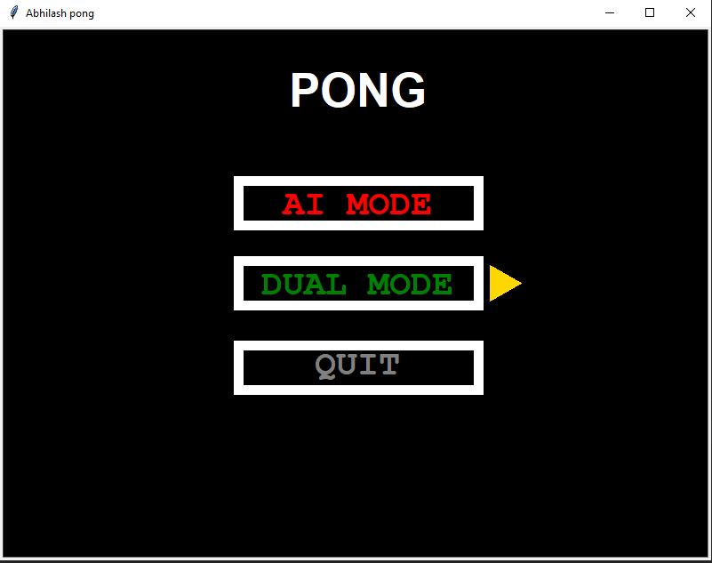
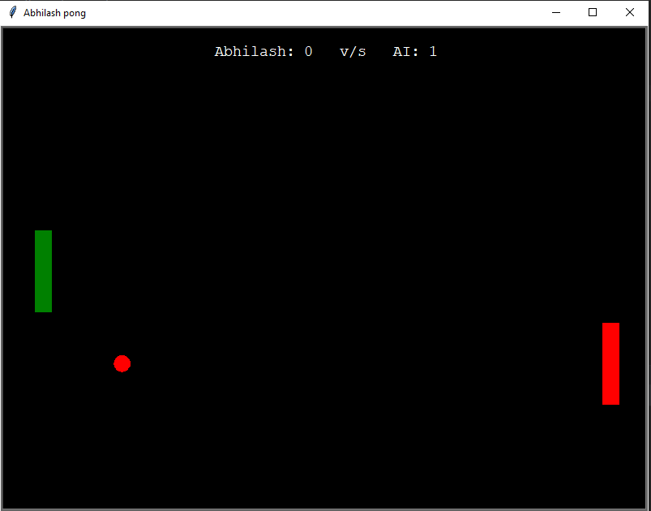

# Pong-PythonGame
A GUI version of pong game in python.
|Pong Game| Pong Menu |
|------|-------|
|||

### Languages & tools :
[][python]
[][python]
  

### Connect with me :  

  
 

[python]: https://github.com/AbhilashTUofficial/Python-programming